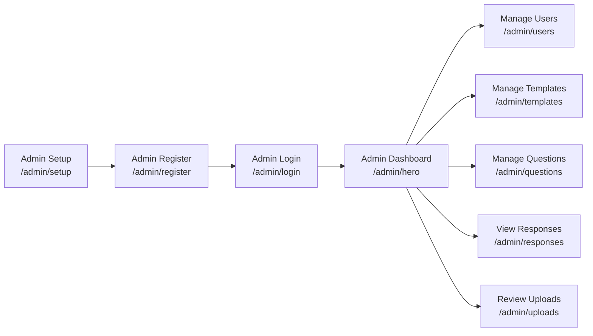
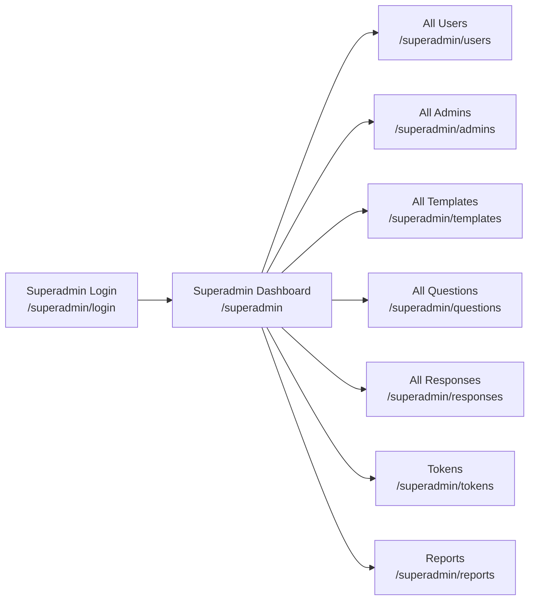

<!-- COVER PAGE -->


# Codeless

## Multi-Tenant SaaS Platform

### Professional Route & Feature Guide

---

## Table of Contents

- [User Flow](#user-flow)
- [Admin Flow](#admin-flow)
- [Superadmin Flow](#superadmin-flow)
- [All Routes & Pages](#all-routes--pages)
- [Multi-Tenancy & Data Isolation](#multi-tenancy--data-isolation)
- [API Endpoints](#api-endpoints)
- [Summary](#summary)

---

## User Flow

```mermaid
flowchart LR
    A[User Registration<br/>/user/register] --> B[User Login<br/>/user/login]
    B --> C[User Dashboard<br/>/user/home]
    C --> D[View Templates<br/>/user/tem]
    D --> E[Fill Template<br/>/user/tem/[templateId]]
    C --> F[Profile<br/>/user/profile/[id]]
    C --> G[Contact/FAQ]
```

---

## Admin Flow



---

## Superadmin Flow



---

## All Routes & Pages

### User

| Route                        | Description                                 |
|------------------------------|---------------------------------------------|
| `/user/register`             | Register as a user (with organization name) |
| `/user/login`                | User login                                  |
| `/user/tem`                  | List available templates                    |
| `/user/tem/[templateId]`     | Fill out a specific template                |
| `/user/profile/[id]`         | User profile                                |
| `/user/contact`              | Contact support/admin                       |
| `/user/FAQ`                  | Frequently Asked Questions                  |
| `/user/home`                 | User dashboard                              |

---

### Admin

| Route                        | Description                                 |
|------------------------------|---------------------------------------------|
| `/admin/setup`               | Enter org token to access admin registration|
| `/admin/register`            | Register as an admin                        |
| `/admin/login`               | Admin login                                 |
| `/admin/hero`                | Admin dashboard (stats, charts, actions)    |
| `/admin/users`               | Manage users in the organization            |
| `/admin/questions`           | Manage/view questions                       |
| `/admin/responses`           | View user responses                         |
| `/admin/templates`           | Manage templates                            |
| `/admin/uploads`             | Review uploads from users                   |
| `/admin/tempall`             | View/manage all templates                   |
| `/admin/tempall/[id]`        | View/manage a specific template             |
| `/admin/edit/[id]`           | Edit a specific item/template               |

---

### Superadmin

| Route                        | Description                                 |
|------------------------------|---------------------------------------------|
| `/superadmin/login`          | Superadmin login                            |
| `/superadmin`                | Superadmin dashboard (tabs for all features)|
| `/superadmin/users`          | View all users (all orgs)                   |
| `/superadmin/admins`         | View all admins (all orgs)                  |
| `/superadmin/templates`      | View all templates (all orgs)               |
| `/superadmin/questions`      | View all questions (all orgs)               |
| `/superadmin/responses`      | View all responses (all orgs)               |
| `/superadmin/tokens`         | Manage org tokens                           |
| `/superadmin/reports`        | View all reports                            |

---

## Multi-Tenancy & Data Isolation

- **Each organization (tenant) is isolated by a unique token or name.**
- **Admins and users only see/manage data for their own organization.**
- **Superadmin can see and manage all data across all organizations.**
- **All API endpoints filter data by tenant unless `?all=true` is used by superadmin.**

---

## API Endpoints

| Endpoint                     | Description                                 |
|------------------------------|---------------------------------------------|
| `/api/users?all=true`        | Get all users (superadmin)                  |
| `/api/admins?all=true`       | Get all admins (superadmin)                 |
| `/api/templates?all=true`    | Get all templates (superadmin)              |
| `/api/questions?all=true`    | Get all questions (superadmin)              |
| `/api/responses?all=true`    | Get all responses (superadmin)              |
| `/api/admin/users`           | Get users for an admin’s org                |
| `/api/admin/register`        | Register or get admin info                  |
| `/api/admin/login`           | Admin login                                 |
| `/api/user/register`         | User registration                           |
| `/api/user/login`            | User login                                  |

---

## Summary

- **Codeless** is a modern, multi-tenant SaaS platform for organizations.
- **Superadmin** can manage everything across all organizations.
- **Admins** manage their own org’s users, templates, questions, and responses.
- **Users** interact with templates and submit responses for their org.
- **All data is isolated by organization, ensuring privacy and security.**

---

<p align="center" style="color:#2563eb;">
  <b>Thank you for using Codeless!</b>
</p> 